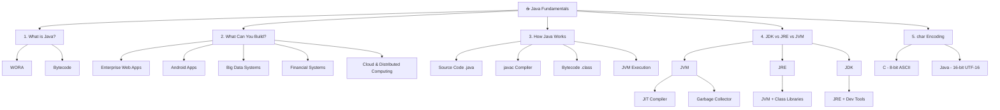

# 01. The Fundamentals

## Table of Contents

1. [What is Java?](#1-what-is-java)
2. [What Can You Build with Java?](#2-what-can-you-build-with-java)
3. [How Java Works](#3-how-java-works)
4. [Deep Dive: JDK vs. JRE vs. JVM](#4-deep-dive-jdk-vs-jre-vs-jvm)
5. [Deep Dive: Java char vs. C char](#5-deep-dive-java-char-vs-c-char)
6. [🧠 Mental Model](#-mental-model)
7. [📌 Key Terms to Remember](#-key-terms-to-remember)

---

## 🗺️ Mind Map


---

## 1. What is Java?

**Java** is a high-level, class-based, object oriented programming language designed to be platform-independent. Developed by Sun Microsystems (now owned by Oracle) in 1995, its core philosophy is **WORA** (*"Write Once, Run Anywhere"*).

Unlike languages like C/C++ that compile directly into platform-specific machine code, Java compiles into an intermediate format called **Bytecode**, which allows Java applications to run on any operating system equipped with a Java Virtual Machine (JVM).

## 2. What Can You Build with Java?

Java powers enterprise-grade infrastructure across industries:

- **Enterprise Web Applications**: Backend systems built with frameworks like **Spring Boot** and **Jakarta EE**.
- **Android Mobile Applications**: Android OS relies heavily on Java runtime environments and libraries.
- **Big Data Systems**: Industry-standard platforms like **Apache Hadoop**, **Apache Spark**, and **Apache Kafka** are built using Java/Scala.
- **Financial & Trading Systems**: Preferred by banks and stock exchanges due to robust security, concurrency control, and strong performance.
- **Cloud & Distributed Computing**: Scalable microservices hosted on AWS, GCP, and Azure.

## 3. How Java Works

Java uses a **two-step execution model**: Compilation followed by Interpretation/JIT Compilation.

```
+------------------+       javac Compiler       +------------------+
| Source Code      |  --------------------->    | Bytecode         |
| (Main.java)      |                            | (Main.class)     |
+------------------+                            +------------------+
                                                         |
                                                         v
                                                +------------------+
                                                | Java Virtual     |
                                                | Machine (JVM)    |
                                                +------------------+
                                                         |
                                                         v
                                                +------------------+
                                                | Native Machine   |
                                                | Code (OS/CPU)    |
                                                +------------------+
```

### Step-by-Step Breakdown

1. **Writing Code**: Developers write human readable code in files with a `.java` extension.
2. **Compilation**: The Java Compiler (`javac`) converts `.java` files into platform-neutral **Bytecode** stored in `.class` files.
3. **Execution**: The **JVM** reads the bytecode, translates it into native CPU instructions, and executes it on the host operating system.

## 4. Deep Dive: JDK vs. JRE vs. JVM

Understanding the distinctions between JDK, JRE, and JVM is fundamental to Java architecture.

```
+-------------------------------------------------------------------+
| JDK (Java Development Kit)                                        |
|  +-------------------------------------------------------------+  |
|  | JRE (Java Runtime Environment)                              |  |
|  |  +-------------------------------------------------------+  |  |
|  |  | JVM (Java Virtual Machine)                            |  |  |
|  |  | - JIT Compiler                                        |  |  |
|  |  | - Garbage Collector                                   |  |  |
|  |  +-------------------------------------------------------+  |  |
|  |  - Core Class Libraries (`rt.jar`, `java.lang`, etc.)       |  |
|  +-------------------------------------------------------------+  |
|  - Development Tools (`javac`, `javadoc`, `jdb`, `jar`)           |
+-------------------------------------------------------------------+
```

### 4.1. JVM (Java Virtual Machine)

- **What it is**: An abstract runtime engine that executes Java bytecode.
- **Key Functions**:
    - Loads code (Class Loader).
    - Verifies bytecode for security.
    - Executes bytecode using an **Interpreter** and **JIT (Just-In-Time) Compiler**.
    - Performs automatic memory management via **Garbage Collection (GC)**.

### 4.2. JRE (Java Runtime Environment)

- **What it is**: The software bundle required to **run** compiled Java applications.
- **Components**: Contains the **JVM** plus the core **Class Libraries** (standard data structures, I/O libraries, networking, etc.).

### 4.3. JDK (Java Development Kit)

- **What it is**: The complete software development package required to **write, compile, and debug** Java applications.
- **Components**: Contains **JRE** + **Development Tools** (such as the `javac` compiler, `jdb` debugger, and `jar` archiver).

#### Cheatsheet: JVM vs JRE vs JDK

| **Tool** | **Who Needs It?** | **Primary Purpose** |
| --- | --- | --- |
| **JVM** | Execution Engine | Translates bytecode to machine code. |
| **JRE** | End Users | Runs Java applications. |
| **JDK** | Developers | Develops, compiles, and runs Java applications. |

## 5. Deep Dive: Java `char` vs. C `char`

A fundamental distinction between C and Java lies in character encoding:

- **C Language `char` (8-bit ASCII):** Uses 1 byte of memory, capable of storing only 256 unique characters (primarily English alphabet and basic symbols).
- **Java Language `char` (16-bit UTF-16 Unicode):** Uses 2 bytes (16 bits) of memory. This allows Java to natively support international scripts (Bangla, Chinese, Arabic, etc.), special math symbols, and expanded character sets.

### Code Example

```java
public class CharDemo {
    public static void main(String[] args){
        char englishChar = 'A';
        char banglaChar = 'অ';
        char unicodeHex = '\u0985'; // Unicode representation of 'অ'

        System.out.println("English Character: " + englishChar);
        System.out.println("Bangla Character: " + banglaChar);
        System.out.println("Unicode Hex Character: " + unicodeHex);
    }
}
```

### Output

```
English Character: A
Bangla Character: অ
Unicode Hex Character: অ
```

## 🧠 Mental Model

Picture a **cricket match broadcast**:

- The **commentator's script** (your `.java` source code) is written in plain language.
- The **broadcast encoder** (`javac`) converts that script into a universal **signal format** (bytecode) — a format any TV in any country can decode.
- The **TV/set-top box** (JVM) in each country decodes that universal signal into whatever's native to its screen (machine code for that OS/CPU).

That's WORA: one script (source code), one universal signal (bytecode), many decoders (JVMs) — same broadcast plays correctly everywhere.

For JDK/JRE/JVM: the **JVM** is the decoder chip inside the TV. The **JRE** is the whole TV set (decoder + channel presets/libraries). The **JDK** is the entire production studio (TV + cameras + editing tools) — you only need the full studio if you're *making* broadcasts, not just watching them.

## 📌 Key Terms to Remember

- **Bytecode** — platform-neutral intermediate code produced by `javac`
- **JVM** — engine that executes bytecode
- **JRE** — JVM + standard libraries (for running apps)
- **JDK** — JRE + development tools (for building apps)
- **WORA** — Write Once, Run Anywhere
- **Unicode (UTF-16)** — Java's 16-bit character encoding

---
