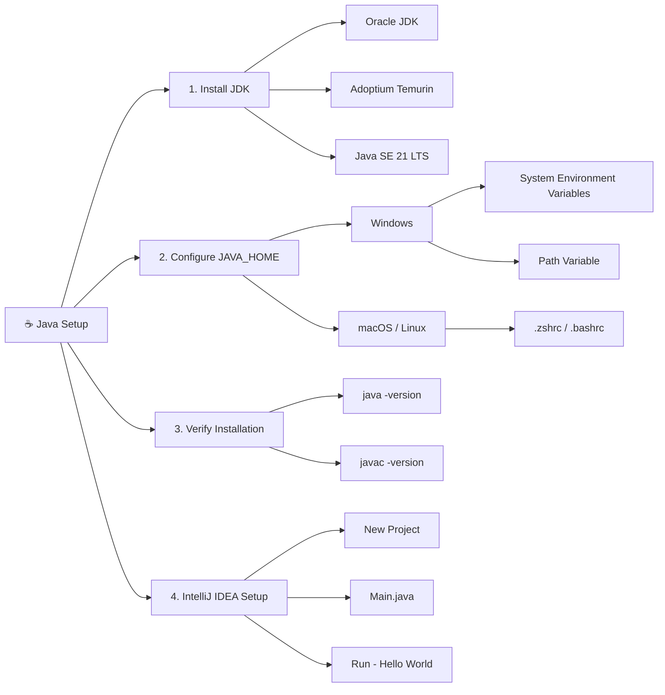

# 02. Setup & Installation

## Table of Contents

1. [Step 1: Download & Install JDK](#step-1-download--install-jdk)
2. [Step 2: Configure System Environment Variables](#step-2-configure-system-environment-variables)
3. [Step 3: Verify Terminal Installation](#step-3-verify-terminal-installation)
4. [Step 4: Install IntelliJ IDEA & Run First Application](#step-4-install-intellij-idea--run-first-application)

---

## 🗺️ Mind Map
 


---

## Step 1: Download & Install JDK

1. Visit the **Oracle JDK** or **Adoptium (Eclipse Temurin)** download page.
2. Select **Java SE 21 (LTS)** for your OS (Windows / macOS / Linux).
3. Download and run the installer (`.exe` for Windows, `.dmg` for macOS).

## Step 2: Configure System Environment Variables

Setting `JAVA_HOME` enables global command-line access to Java tools.

### On Windows

1. Open Windows Search and type **"Edit the system environment variables"**.
2. Click **Environment Variables...**
3. Under **System Variables**, click **New**:
    - **Variable name:** `JAVA_HOME`
    - **Variable value:** `C:\Program Files\Java\jdk-21` *(Path to your installed JDK)*
4. Find `Path` under **System Variables** click **Edit** click **New**:
    - Add: `%JAVA_HOME%\bin` *(Path to your bin folder)*
5. Click **OK** to save changes.

### On macOS / Linux

Add the following to your `~/.zshrc` or `~/.bashrc` file:

```bash
export JAVA_HOME=$(/usr/libexec/java_home)
export PATH=$JAVA_HOME/bin:$PATH
```

## Step 3: Verify Terminal Installation

Open a command prompt or terminal window and execute:

```bash
java -version
javac -version
```

> **Expected Output:** Returns the active version of the Java runtime and compiler (e.g., `javac 21.0.2`).

## Step 4: Install IntelliJ IDEA & Run First Application

1. Download **IntelliJ IDEA Community Edition** (Free) from JetBrains.
2. Run the installer and keep the default preferences.
3. Open IntelliJ IDEA click **New Project**:
    - **Name**: `JavaBasics`
    - **Language**: Java
    - **Build System**: IntelliJ
    - **JDK**: Select installed JDK 21.
4. Replace contents of `src/Main.java` with:

```java
public class Main{
    public static void main(String[] args){
        System.out.println("Hello World!");
    }
}
```

5. Press `Shift + F10` or click the green **Play** icon to execute.

> If the output shows `Hello World!` then good to go.

---
