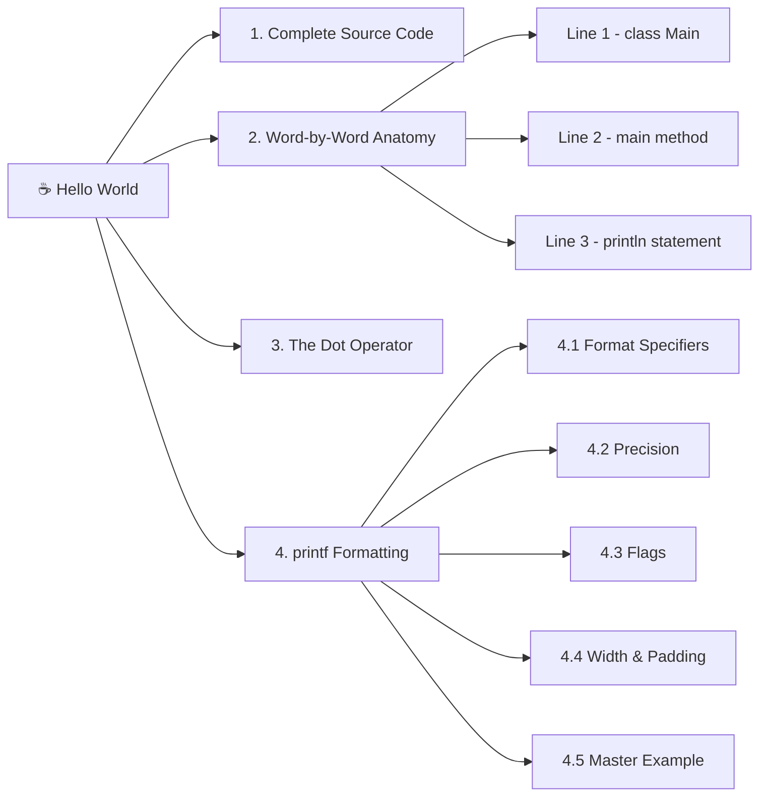

# 03. Your First Java Program: Hello World

## Table of Contents

1. [Complete Source Code](#1-complete-source-code)
2. [Word-by-Word Technical Anatomy](#2-word-by-word-technical-anatomy)
3. [Deep Dive: What Does the Dot (.) Operator Mean?](#3-deep-dive-what-does-the-dot--operator-mean)
4. [Advanced Output Formatting with printf()](#4-advanced-output-formatting-with-printf)

---

## 🗺️ Mind Map



*Left-to-right, top-to-bottom order matches the document's 1–4 reading sequence.*

---

The standard Java "Hello World" program serves as the entry point for understanding Java syntax, structure, and execution semantics.

## 1. Complete Source Code

```java
public class Main{
    public static void main(String[] args){
        System.out.println("Hello, World!");
    }
}
```

## 2. Word-by-Word Technical Anatomy

### Line 1: Class Definition (`public class Main`)

```java
public class Main
```

- **`public`** *(Access Modifier)*: Declares the visibility of the class. Marking a class `public` means it can be accessed from any other package in the Java runtime environment.
- **`class`** *(Keyword)*: The core building block of Java. Every executable statement in Java must reside inside a class definition.
- **`Main`** *(Identifier)*: The name of the class.

    > **Note:** In Java, if a class is declared `public`, the filename **must match** the class name exactly (including case). Therefore, this file must be saved as `Main.java`.

### Line 2: The Main Method (`public static void main(String[] args)`)

```java
public static void main(String[] args)
```

This specific method signature is the **standard execution entry point** recognized by the Java Virtual Machine (JVM).

- **`public`** *(Access Modifier)*: Makes the method accessible to the JVM from outside the class context during execution.
- **`static`** *(Keyword)*: Allows the JVM to invoke the `main` method **without instantiating** an object of the `Main` class. It exists in class memory right when the class is loaded.
- **`void`** *(Return Type)*: Specifies that this method does not return any value back to the caller (the JVM).
- **`main`** *(Method Identifier)*: The exact method name the JVM looks for to start program execution.
- **`String[]`** *(Data Type)*: Indicates an array of `String` objects.
- **`args`** *(Variable Name)*: Short for "arguments". It holds command-line inputs passed to the application at launch.

### Line 3: Output Statement (`System.out.println("Hello, World!");`)

```java
System.out.println("Hello, World!");
```

- **`System`** *(Built-in Class)*: A `final` class provided by the `java.lang` package containing utility methods and system resources.
- **`out`** *(Static Field)*: An instance of `java.io.PrintStream` held as a static member in the `System` class. It represents the **Standard Output Stream** (the terminal/console).
- **`println()`** *(Method)*: Short for "print line". It outputs the provided parameter to the standard output and appends a new line (`\n`) character at the end. We can skip `ln` if we don;t want any new line.
- **`"Hello, World!"`** *(String Literal)*: The exact text data passed as an argument to the `println()` method.
- **`;`** *(Semicolon)*: The statement terminator in Java syntax. It informs the compiler that the instruction ends here.

## 3. Deep Dive: What Does the Dot (`.`) Operator Mean?

In Java, the dot (`.`) operator is the **Member Access Operator**. It is used to access fields, methods, or nested structures within a class, package, or object reference.

```
System  .  out  .  println("Hello, World!");
 │          │        │
 │          │        └─> 3. Call the method inside PrintStream
 │          └─> 2. Access the static stream field inside System
 └─> 1. Target the System class
```

1. **`System.out`**: Accesses the static field `out` defined inside the `System` class.
2. **`out.println()`**: Accesses and calls the `println()` method attached to that `out` stream object.

## 4. Advanced Output Formatting with printf()

While `System.out.println()` prints raw data line-by-line, `System.out.printf()` (print formatted) allows you to format text, align numbers in neat tables, control decimal precision, and add currency separators.

### 4.1. Structure of printf() Format Specifiers

Every format placeholder starts with a `%` symbol and follows this general pattern:

$$\% \text{ [flags] } \text{ [width] } \text{ [.precision] } \text{ [conversion-character]}$$

```
  %     +      10     .2    f
  │     │      │      │     │
  │     │      │      │     └─ Format Type (f = floating-point)
  │     │      │      └────── Decimal Precision (2 decimal places)
  │     │      └───────────── Minimum Field Width (10 spaces wide)
  │     └──────────────────── Flag (+ sign for positive numbers)
  └────────────────────────── Start of Placeholder
```

#### Essential Conversion Characters

| Specifier | Data Type | Description |
|---|---|---|
| `%d` | int, long, byte, short | Decimal integer |
| `%f` | float, double | Floating-point decimal number |
| `%s` | String | String of text |
| `%c` | char | Single character |
| `%b` | boolean | Boolean value (true/false) |
| `%n` | Line Break | Platform-independent newline (equivalent to `\n`) |

### 4.2. Floating-Point Precision (.precision)

By default, `%f` prints floating-point numbers with 6 decimal places. Using `.precision` lets you specify exact decimal places. Java automatically rounds the number to fit the precision.

**Code Example:**

```java
public class PrecisionExample {
    public static void main(String[] args) {
        double price1 = 9.99;
        double price2 = 100455454.15;
        double price3 = -54.01;

        // Default %f prints 6 decimal places
        System.out.printf("Default: %f\n", price1); // 9.990000

        // Format to 3 decimal places (%.3f)
        System.out.printf("Precision: %.3f\n", price1);
        System.out.printf("Precision: %.3f\n", price2);
        System.out.printf("Precision: %.3f\n", price3);
    }
}
```

**Output:**

```
Default: 9.990000
Precision: 9.990
Precision: 100455454.150
Precision: -54.010
```

### 4.3. Format Flags ([flags])

Flags allow you to add special visual formatting to your numbers, such as comma separators, sign symbols, and parentheses for negative values.

| Flag | Name | Function | Example | Result |
|---|---|---|---|---|
| `+` | Plus Sign | Outputs an explicit `+` for positive values | `%+f` (with 5.0) | `+5.000000` |
| `,` | Grouping Separator | Adds comma separators for large thousands/millions | `%,.2f` (with 100455454.15) | `100,455,454.15` |
| `(` | Negative Parentheses | Encloses negative numbers in parentheses `()` | `%(f` (with -54.01) | `(54.010000)` |
| ` ` (space) | Space Padding | Displays a space for positive numbers, `-` for negative | `% f` (with 9.99) | ` 9.990000` |

**Code Example:**

```java
public class FlagsExample {
    public static void main(String[] args) {
        double positiveNum = 100455454.15;
        double negativeNum = -54.01;

        // Comma separator with 2 decimal precision
        System.out.printf("Formatted Price: $%,.2f\n", positiveNum);

        // Explicit positive sign (+)
        System.out.printf("Temperature Change: %+f\n", positiveNum);

        // Enclose negative numbers in parentheses
        System.out.printf("Account Balance: %(f\n", negativeNum);
    }
}
```

**Output:**

```
Formatted Price: $100,455,454.15
Temperature Change: +100455454.150000
Account Balance: (54.010000)
```

### 4.4. Field Width & Alignment Padding ([width])

Field width defines the minimum number of characters to write to the output. If the value is shorter than the width, it will be padded with spaces or zeros.

| Width Syntax | Alignment / Padding Type | Explanation |
|---|---|---|
| `%10d` | Right-Justified | Pads spaces on the left to make total width 10 characters. |
| `%-10d` | Left-Justified | Pads spaces on the right to make total width 10 characters. |
| `%04d` | Zero Padding | Pads leading zeros (0) on the left to reach width 4. |

**Code Example:**

```java
public class WidthPaddingExample {
    public static void main(String[] args) {
        int id1 = 1;
        int id2 = 23;
        int id3 = 456;
        int id4 = 7890;

        System.out.println("--- Zero Padding (%04d) ---");
        System.out.printf("id: %04d\n", id1);
        System.out.printf("id: %04d\n", id2);
        System.out.printf("id: %04d\n", id3);
        System.out.printf("id: %04d\n", id4);

        System.out.println("\n--- Right Alignment (%10s) ---");
        System.out.printf("%10s : $%06.2f\n", "Item A", 9.99);
        System.out.printf("%10s : $%06.2f\n", "Item B", 154.50);

        System.out.println("\n--- Left Alignment (%-10s) ---");
        System.out.printf("%-10s : $%06.2f\n", "Item A", 9.99);
        System.out.printf("%-10s : $%06.2f\n", "Item B", 154.50);
    }
}
```

**Output:**

```
--- Zero Padding (%04d) ---
id: 0001
id: 0023
id: 0456
id: 7890

--- Right Alignment (%10s) ---
    Item A : $009.99
    Item B : $154.50

--- Left Alignment (%-10s) ---
Item A     : $009.99
Item B     : $154.50
```

### 4.5. Master Combined Example

Here is a full program combining precision, flags, and width/padding together:

```java
public class FormattedOutputMaster {
    public static void main(String[] args) {
        String item1 = "Laptop";
        double price1 = 1299.99;
        int id1 = 101;

        String item2 = "Mouse";
        double price2 = 25.5;
        int id2 = 2;

        System.out.println("==========================================");
        System.out.printf("%-6s | %-12s | %15s\n", "ID", "ITEM NAME", "PRICE");
        System.out.println("==========================================");

        // %04d   = 4-digit ID with leading zeros
        // %-12s  = Left-aligned 12-char item name
        // %,15.2f = Right-aligned 15-char price with commas & 2 decimals
        System.out.printf("#%04d | %-12s | $%,15.2f\n", id1, item1, price1);
        System.out.printf("#%04d | %-12s | $%,15.2f\n", id2, item2, price2);
        
        System.out.println("==========================================");
    }
}
```

**Output:**

```
==========================================
ID     | ITEM NAME    |           PRICE
==========================================
#0101 | Laptop       | $       1,299.99
#0002 | Mouse        | $          25.50
==========================================
```

---
