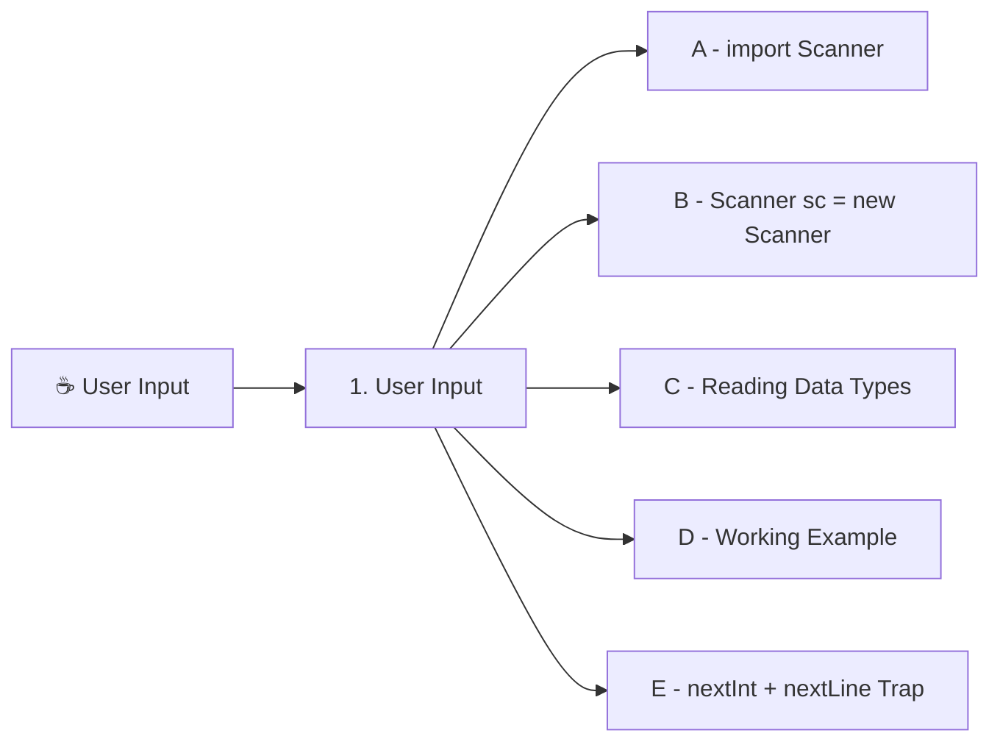

# 07. Taking User Input in JAVA

## Table of Contents

1. [User Input](#1-user-input)

---

## 🗺️ Mind Map



*Left-to-right, top-to-bottom order matches the document's 1–5 reading sequence.*

---

## 1. User Input

### A) The "Header" (`import` statement)

In **C**, you wrote `#include <stdio.h>` at the very top of your file to use functions like `printf()` and `scanf()`.

In **Java**, we use the `import` keyword:

```java
import java.util.Scanner;
```

#### What is `import`?

Java keeps its built-in tools organized inside folders called **Packages**.

- To save memory, Java doesn't load every tool automatically.
- By default, Java only loads basic things (like `System.out.println`).
- If you want to use the `Scanner` tool to take user input, you must tell Java where to find it: inside the `java.util` package.

#### What else can you import?

Just like `#include`, you can import different packages for different tools:

- `import java.util.Random;` $\rightarrow$ To generate random numbers.
- `import java.util.Arrays;` $\rightarrow$ To perform operations on arrays.
- `import java.util.*;` $\rightarrow$ The wildcard imports **all** tools inside the `java.util` package at once.

### B) Breaking Down the Scanner Line

Inside your `main` method, you create the input tool using this exact line:

```java
Scanner sc = new Scanner(System.in);
```

Let's break down **every single word** in that line:

| **Word** | **What it means** | **Analogy / Explanation** |
| --- | --- | --- |
| **`Scanner`** | **Data Type / Class Name** | Tells Java what kind of tool we are creating (a Scanner tool). |
| **`sc`** | **Variable Name** | You can name this anything you want! (`input`, `scanner`, `sc`, `myInput`). |
| **`=`** | **Assignment Operator** | Connects the variable `sc` to the new Scanner object created on the right. |
| **`new`** | **Java Keyword** | Tells Java: *"Allocate fresh memory to create a new object."* |
| **`Scanner(...)`** | **Constructor** | Initializes the Scanner tool. |
| **`System.in`** | **Input Source** | Tells the Scanner to listen to your **keyboard** (standard input). |

### C) How to Read Different Types of Input

Once you write `Scanner sc = new Scanner(System.in);`, you can use `sc` to read whatever data type the user types in:

```java
int age = sc.nextInt();         // Reads an integer number
double gpa = sc.nextDouble();   // Reads a decimal number
String word = sc.next();        // Reads a SINGLE word (stops at space)
String line = sc.nextLine();    // Reads a FULL sentence (reads until Enter is pressed)
```

### D) Simple Working Example

Here is a clean, 15-line program taking input for a student's profile:

```java
import java.util.Scanner; // 1. Header import

public class StudentInput{
    public static void main(String[] args){

        // 2. Create the Scanner tool
        Scanner input = new Scanner(System.in);

        // 3. Ask for and read a single word
        System.out.print("Enter your name: ");
        String name = input.next();

        // 4. Ask for and read an integer
        System.out.print("Enter your age: ");
        int age = input.nextInt();

        // 5. Ask for and read a decimal number
        System.out.print("Enter your GPA: ");
        double gpa = input.nextDouble();

        // 6. Print the results
        System.out.println("\n--- Student Details ---");
        System.out.println("Name : " + name);
        System.out.println("Age  : " + age);
        System.out.println("GPA  : " + gpa);

        // 7. Close the scanner when done
        input.close();
    }
}
```

#### Output:

```
Enter your name: Alex
Enter your age: 21
Enter your GPA: 3.85

--- Student Details ---
Name : Alex
Age  : 21
GPA  : 3.85
```

### E) ⚠️ The `nextInt()` + `nextLine()` Trap

If you ask for a number (`nextInt()`) and then immediately ask for a full sentence (`nextLine()`), Java skips the text input!

#### Why?

When you type `21` and hit **Enter**, `nextInt()` reads the `21`, but leaves the **Enter key action (`\n`)** behind. Then `nextLine()` sees that leftover **Enter** and thinks you pressed enter without typing anything!

#### The Easy Fix:

Just add an extra `input.nextLine();` in between to clear that leftover Enter key:

```java
System.out.print("Enter your age: ");
int age = input.nextInt();

input.nextLine(); // Clear the leftover Enter key!

System.out.print("Enter your full address: ");
String address = input.nextLine(); // Now works perfectly!
```

---
