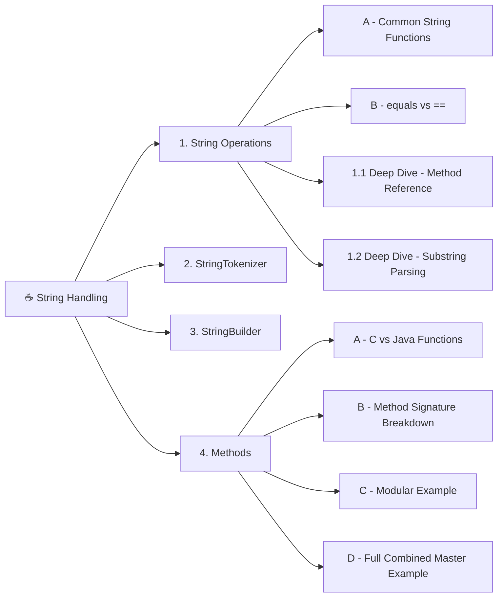

# 08. String Handling in Java

## Table of Contents

1. [String Operations & Useful Functions](#1-string-operations--useful-functions)
2. [StringTokenizer (Splitting Text Easily)](#2-stringtokenizer-splitting-text-easily)
3. [StringBuilder (For Modifying & Reversing Text)](#3-stringbuilder-for-modifying--reversing-text)
4. [Methods (Java's "Functions")](#4-methods-javas-functions)
5. [🧠 Mental Model](#-mental-model)
6. [📌 Key Terms to Remember](#-key-terms-to-remember)

---

## 🗺️ Mind Map



*Left-to-right, top-to-bottom order matches the document's 1–4 reading sequence.*

---

## 1. String Operations & Useful Functions

In Java, `String` comes with built-in "shortcut" functions that let you inspect, modify, and format text effortlessly.

### A) Most Commonly Used String Functions

Here are the most essential built-in String methods you will use every day:

| **Method** | **What it does** | **Simple Example** | **Output** |
| --- | --- | --- | --- |
| `length()` | Returns the total number of characters | `"Hello".length()` | `5` |
| `charAt(index)` | Gets the character at a specific position (starts at 0) | `"Java".charAt(1)` | `'a'` |
| `toLowerCase()` / `toUpperCase()` | Converts text to all lowercase or uppercase | `"Java".toUpperCase()` | `"JAVA"` |
| `trim()` | Removes extra spaces from the start and end | `"  hi  ".trim()` | `"hi"` |
| `substring(start, end)` | Cuts out a part of the text (end index is excluded) | `"Coding".substring(0, 4)` | `"Codi"` |
| `contains("text")` | Checks if a word/letter exists inside the string | `"Java".contains("av")` | `true` |
| `replace(old, new)` | Replaces characters or words with new ones | `"banana".replace("a", "o")` | `"bonono"` |
| `equalsIgnoreCase(text)` | Compares two strings ignoring capital/small letters | `"java".equalsIgnoreCase("JAVA")` | `true` |
| `split("delimiter")` | Cuts a string into an array based on a separator | `"A,B,C".split(",")` | `["A", "B", "C"]` |

### B) Comparing Strings: `equals()` vs `==`

> ⚠️ **Important Java Rule:** Never use `==` to compare two text strings!
> - `==` checks if two strings share the **exact same memory location**.
> - `.equals()` checks if two strings contain the **same text characters**.

```java
String s1 = "hello";
String s2 = new String("hello");

System.out.println(s1 == s2);      // false (Different memory locations!)
System.out.println(s1.equals(s2)); // true  (Same exact text content!)
```

### 1.1. Deep Dive: Comprehensive String Methods Reference

`String` is an object that represents a sequence of characters. The `String` class provides a rich set of built-in methods to inspect, search, clean, and modify text content.

#### Method Reference Table

| Method | Return Type | Description / Usage |
|---|---|---|
| `length()` | int | Returns the total number of characters in the string. |
| `charAt(index)` | char | Returns the character at the specified index. |
| `indexOf("str")` | int | Returns index of first occurrence of text (or -1 if not found). |
| `lastIndexOf("str")` | int | Returns index of last occurrence of text (or -1 if not found). |
| `toLowerCase()` | String | Converts all characters to lowercase. |
| `toUpperCase()` | String | Converts all characters to uppercase. |
| `trim()` | String | Removes leading and trailing whitespaces. |
| `replace(old, new)` | String | Replaces all occurrences of a character/sequence with a new one. |
| `isEmpty()` | boolean | Returns true if length is 0. |
| `contains("str")` | boolean | Checks if a specific sequence of characters exists. |
| `equalsIgnoreCase()` | boolean | Compares two strings ignoring uppercase/lowercase differences. |

#### Code Example: String Utility Methods

```java
public class StringMethodsDemo {
    public static void main(String[] args) {

        String rawText = "   Hello Java Developers!   ";
        String name = "Bro Code";

        // 1. Length & Inspection
        System.out.println("Original Length: " + rawText.length());
        
        // 2. Trimming Whitespace
        String trimmedText = rawText.trim();
        System.out.println("Trimmed Text: '" + trimmedText + "'");
        System.out.println("Trimmed Length: " + trimmedText.length());

        // 3. Case Conversion
        System.out.println("Uppercase: " + trimmedText.toUpperCase());
        System.out.println("Lowercase: " + trimmedText.toLowerCase());

        // 4. Character Retrieval & Searching
        System.out.println("Character at index 4: " + trimmedText.charAt(4));
        System.out.println("First index of 'e': " + trimmedText.indexOf('e'));
        System.out.println("Last index of 'e': " + trimmedText.lastIndexOf('e'));

        // 5. Manipulation & Replacement
        String replacedText = trimmedText.replace('o', 'a');
        System.out.println("Replaced ('o' -> 'a'): " + replacedText);

        // 6. Boolean Checks
        System.out.println("Is Empty? " + name.isEmpty());
        System.out.println("Contains 'Java'? " + trimmedText.contains("Java"));
        
        // 7. Case-Insensitive Comparison
        String userRole = "ADMIN";
        System.out.println("Equals Admin? " + userRole.equalsIgnoreCase("admin"));
    }
}
```

**Output:**

```
Original Length: 28
Trimmed Text: 'Hello Java Developers!'
Trimmed Length: 22
Uppercase: HELLO JAVA DEVELOPERS!
Lowercase: hello java developers!
Character at index 4: o
First index of 'e': 1
Last index of 'e': 18
Replaced ('o' -> 'a'): Hella Java Develapers!
Is Empty? false
Contains 'Java'? true
Equals Admin? true
```

### 1.2. Deep Dive: Dynamic Substring Parsing (Email Parser Project)

The `substring()` method extracts a portion of a string between specified indices:

- `substring(startIndex)`: Extracts from `startIndex` to the end of the string.
- `substring(startIndex, endIndex)`: Extracts from `startIndex` up to (but not including) `endIndex`.

**💡 Why Dynamic Substring Parsing?**

Hardcoded index values like `email.substring(0, 8)` break when user input length changes. By combining `indexOf("@")` with `substring()`, we can dynamically locate boundaries in any text string regardless of its length.

#### Code Example: Dynamic Email Extraction

```java
public class EmailSubstringParser {
    public static void main(String[] args) {

        String email = "john.doe@gmail.com";

        // Step 1: Dynamically find the index position of '@'
        int atSymbolIndex = email.indexOf("@");

        // Step 2: Validate if '@' symbol exists
        if (atSymbolIndex != -1) {

            // Extract Username (from index 0 up to '@')
            String username = email.substring(0, atSymbolIndex);

            // Extract Domain (from index after '@' to the end)
            String domain = email.substring(atSymbolIndex + 1);

            System.out.println("=================================");
            System.out.println("Full Email : " + email);
            System.out.println("Username   : " + username);
            System.out.println("Domain     : " + domain);
            System.out.println("=================================");

        } else {
            System.out.println("Invalid email address: Missing '@' symbol.");
        }
    }
}
```

#### How It Works (Step-by-Step Breakdown)

For input string `"john.doe@gmail.com"`:

```
  Index:   0 1 2 3 4 5 6 7  8  9 10 11 12 13 14 15 16 17
  Char:    j o h n . d o e  @  g  m  a  i  l  .  c  o  m
                            ▲
                            │
                    indexOf("@") = 8
```

- `email.indexOf("@")` finds the exact position of `@`, which is index 8.
- `email.substring(0, 8)` extracts characters from index 0 to 7 $\rightarrow$ `"john.doe"`.
- `email.substring(8 + 1)` starts at index 9 through the end of string $\rightarrow$ `"gmail.com"`.

**Output:**

```
=================================
Full Email : john.doe@gmail.com
Username   : john.doe
Domain     : gmail.com
=================================
```

## 2. StringTokenizer (Splitting Text Easily)

If you have a long line of text separated by spaces, commas, or hyphens, `StringTokenizer` breaks it down into individual words (called **tokens**).

### Example:

```java
import java.util.StringTokenizer;

public class TokenizerSimple{
    public static void main(String[] args){
        String data = "Apple,Banana,Mango,Orange";

        // Break text whenever a comma ',' is found
        StringTokenizer st = new StringTokenizer(data, ",");

        // Loop through and print each token
        while (st.hasMoreTokens()) {
            System.out.println(st.nextToken());
        }
    }
}
```

### Output:

```
Apple
Banana
Mango
Orange
```

## 3. StringBuilder (For Modifying & Reversing Text)

Standard Strings in Java cannot be altered once created. If you want to modify, append, or reverse a string easily, use `StringBuilder`:

```java
public class StringBuilderSimple{
    public static void main(String[] args){
        StringBuilder sb = new StringBuilder("Hello");

        sb.append(" World"); // Adds text to the end -> "Hello World"
        sb.reverse();        // Reverses the text       -> "dlroW olleH"

        System.out.println(sb.toString());
    }
}
```

## 4. Methods (Java's "Functions")

In C, you defined functions outside `main()` and called them directly. In Java, functions are called **Methods**.

### A) Comparing C vs Java Functions

- **In C:**

```c
int add(int a, int b){
    return a + b;
}
```

- **In Java:**

```java
public static int add(int a, int b){
    return a + b;
}
```

### B) Line-by-Line Breakdown of a Java Helper Function

```java
public static int calculateSum(int num1, int num2)
```

| **Word** | **What it means** |
| --- | --- |
| `public` | Access modifier (means this method can be accessed from anywhere in the project). |
| `static` | **Crucial keyword!** Allows you to call this method directly from `main()` without creating an object first. |
| `int` | The **Return Type** (what type of data this function sends back). Use `void` if it returns nothing. |
| `calculateSum` | The name of your function (you pick this name). |
| `(int num1, int num2)` | The input parameters (values sent into the function). |

### C) Clean Modular Example (Keeping `main` Simple)

Notice how in this example, `main()` only handles user input and output, while all calculation and formatting logic is handed off to separate helper functions:

```java
import java.util.Scanner;

public class ModularMethods{

    // Helper Function 1: Check if a number is even
    public static boolean isEven(int number){
        return number % 2 == 0;
    }

    // Helper Function 2: Format and clean a user's name
    public static String formatName(String name){
        return name.trim().toUpperCase();
    }

    // Helper Function 3: Perform addition
    public static int addNumbers(int a, int b){
        return a + b;
    }

    // Main Method (Execution starts here)
    public static void main(String[] args){
        Scanner sc = new Scanner(System.in);

        // 1. Take inputs
        System.out.print("Enter your name: ");
        String rawName = sc.nextLine();

        System.out.print("Enter two numbers separated by space: ");
        int x = sc.nextInt();
        int y = sc.nextInt();

        // 2. Pass inputs to helper functions
        String cleanName = formatName(rawName);
        int sum = addNumbers(x, y);
        boolean evenCheck = isEven(sum);

        // 3. Display results
        System.out.println("\n--- Results ---");
        System.out.println("Hello, " + cleanName + "!");
        System.out.println("Sum of numbers: " + sum);
        System.out.println("Is the sum even? " + evenCheck);

        sc.close();
    }
}
```

### D) Full Combined Master Example

This program brings everything together:

- Takes User Input (`Scanner`)
- Uses String utilities (`replace`, `StringBuilder`, `StringTokenizer`)
- Keeps `main()` clean by delegating tasks to static helper functions

```java
import java.util.Scanner;
import java.util.StringTokenizer;

public class TextProcessorApp{

    // Helper Method 1: Count total words in a sentence
    public static int countWords(String sentence){
        StringTokenizer tokenizer = new StringTokenizer(sentence);
        return tokenizer.countTokens();
    }

    // Helper Method 2: Reverse text using StringBuilder
    public static String reverseText(String text){
        return new StringBuilder(text).reverse().toString();
    }

    // Helper Method 3: Replace all spaces with hyphens
    public static String convertToSlug(String text){
        return text.trim().toLowerCase().replace(" ", "-");
    }

    // Main Function
    public static void main(String[] args){
        Scanner input = new Scanner(System.in);

        System.out.print("Enter a sentence: ");
        String userSentence = input.nextLine();

        // Calling helper methods
        int wordCount = countWords(userSentence);
        String reversed = reverseText(userSentence);
        String slug = convertToSlug(userSentence);

        // Output results
        System.out.println("\n--- Processing Output ---");
        System.out.println("Original Sentence : " + userSentence);
        System.out.println("Total Words       : " + wordCount);
        System.out.println("Reversed Sentence : " + reversed);
        System.out.println("URL Format (Slug) : " + slug);

        input.close();
    }
}
```

### Sample Output:

```
Enter a sentence: Java Programming is Fun

--- Processing Output ---
Original Sentence : Java Programming is Fun
Total Words       : 4
Reversed Sentence : nuF si gnimmargorP avaJ
URL Format (Slug) : java-programming-is-fun
```

## 🧠 Mental Model

`Scanner` is like a **team manager taking player registrations** at a tournament desk:

- `Scanner sc = new Scanner(System.in);` = the manager opens a fresh registration sheet, ready to listen to whoever walks up (the keyboard).
- `nextInt()` = the manager reads *only the number* someone says, e.g. jersey number, and stops right there — leaving the "Enter" they pressed sitting on the desk.
- `nextLine()` right after `nextInt()` = the manager glances down and sees that leftover Enter still sitting there, and mistakes it for "the next player said nothing." That's the trap — you need one throwaway `nextLine()` to clear the desk first.

**Strings being immutable** is like a **printed scorecard from a stadium shop** — you can't edit the ink directly, you can only print a *whole new scorecard* (`replace()`, `substring()` etc. all return new Strings). `StringBuilder` is the manager's **whiteboard** instead — you *can* erase and rewrite on it directly (`append`, `reverse`) without printing a new one each time.

**`.equals()` vs `==`** is like checking "do these two scorecards have the same score written on them" (`.equals()`) versus "are these literally the same physical piece of paper" (`==`) — two different printouts can show identical scores but still be different papers.

## 📌 Key Terms to Remember

- **Buffer** — where input sits before being read (source of the `nextInt`/`nextLine` trap)
- **Immutable** — a `String` cannot be changed after creation; operations return new Strings
- **`StringBuilder`** — mutable text tool for efficient append/reverse/modify
- **`StringTokenizer`** — splits text into tokens based on a delimiter
- **Method** — Java's term for a function, usually `static` when called directly from `main`

---
